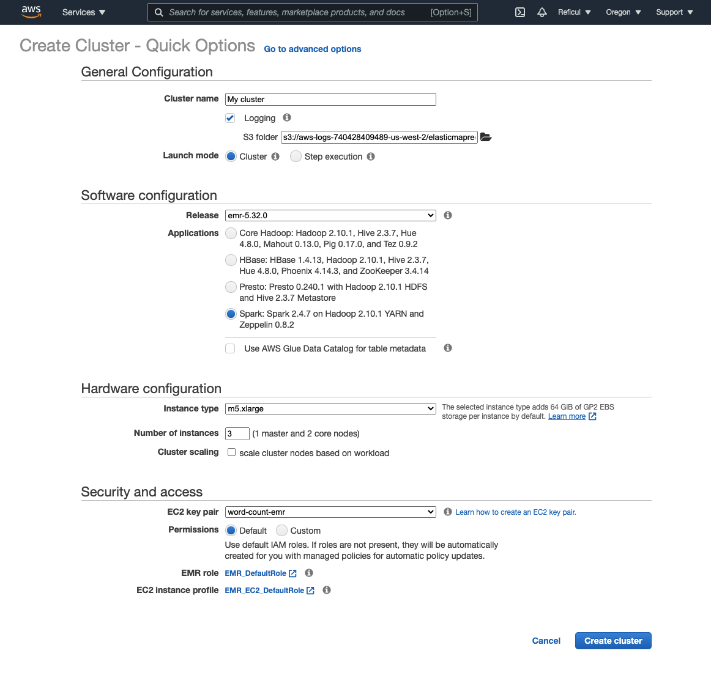
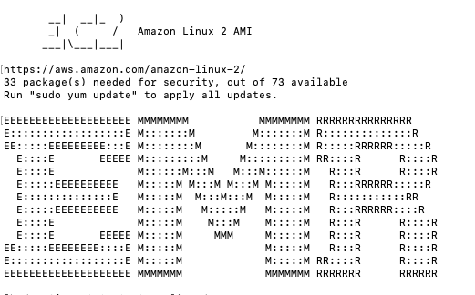
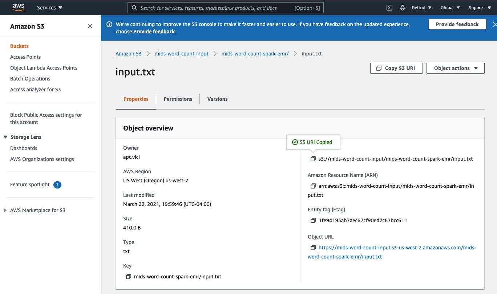

# A simple Word Count Example using pyspark on AWS EMR

#### Clone the repository
- Clone this repo to your local machine and unzip the file.

#### Create cluster
- We'll start off by creating an AWS EMR cluster, just as in the first assignment. Head over to [AWS EMR](https://aws.amazon.com/emr/) and get started.
- Click on Create cluster and configure as per below - 

  

Remark: `m3.xlarge` option is no longer good for this project, the EMR setup will fail if using this option.  

- Click on "Learn how to create an EC2 key pair" to create and modify your EC2 key pair. **This step is very important, and you have to remember the directory where you save the .pem file for the SSH key pairs.**  

- The cluster remains in the 'Starting' state for about 10 - 15 minutes. Once the cluster is ready for use, the status will change to 'Waiting'. You can now go ahead and use it.  

- Don't close this page yet. You will need it later.  

#### Allow inbound SSH traffic on the master node
- On the left top corner goto `Services`->`EC2`, open this link in a new tab.  
- On the left hand panel goto `Security Groups` under Network & Security
- Select the group named "ElasticMapReduce-master" and click Edit in the Inbound tab below
- Add rule, select SSH for type and My IP as source. Save

#### Upload input file on S3
- Now head over to `Services`->`S3` and create a bucket named `word-count-data`, open this S3 link in a new tab or window.  
- In the bucket, create a folder named word-count-spark-emr. 
- Upload the input.txt file from this repo, it is a poem called "No man is an island" by John Donne 
- Head forward and submit the file
- No need to make the file public for everyone, as long as your account could access it. 

#### Creating wordcount.py on the Master node
- Now on our created cluster page (Cluster `list`->`our cluster`)
- Near the `Master public DNS:` field click the SSH button
- Follow the instructions and SSH on the master node. After you follow the instructions and build the connection with AWS EMR through Terminal, the following text will show in the Terminal.  

  

- In `/home/hadoop` create `wordcount.py` using `nano wordcount.py` in the terminal (Mac/Linux System) 
- Copy over the contents from `wordcount.py` in this repo
- In `wordcount.py` change the input file s3 url to point to `input.txt` in your S3 bucket, which was created before. You could copy the link of you S3 bucket as the image shows below.  

  

- Save, if using `nano`, hit `Ctrl + X` and hit `y`, then hit `Enter`. 

#### Executing wordcount.py
- Go through the code in `wordcount.py` and checkout what it does
- Execute the script using `spark-submit wordcount.py | tee output.txt`
- This will also generate `output.txt` with a copy of the logs
- You may have the output file copied to your s3 bucket by using the cmd `aws s3 cp output.txt s3://my_bucket/my_folder/`
- You should see the result of your code among other logs, should look like

  

- You're encouraged to play around with the code, check out the documentation and try things out

#### Terminate the cluster
- Don't forget to terminate your cluster after you're done
- You'll need to follow the same steps next time you create a new cluster with the exception of creating private key for SSH, you can use the same private key for all clusters
- Also make sure to allow inbound SSH traffic on the master every time your machine changes IP, which might happen when you switch between WiFi networks
